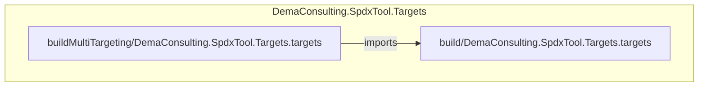
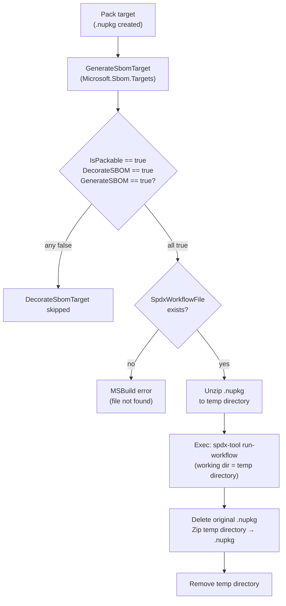

# DemaConsulting.SpdxTool.Targets

## Architecture

`DemaConsulting.SpdxTool.Targets` consists of two MSBuild targets units and no subsystems. The
`buildMultiTargeting` variant imports the `build` variant to ensure SBOM decoration runs exactly
once whether the consuming project targets a single framework or multiple frameworks.

## External Interfaces

**MSBuild Targets Extension**: Exposes the `DecorateSbomTarget` MSBuild target and configurable
properties to consuming .NET projects via the NuGet targets package mechanism.

- *Type*: MSBuild NuGet targets package (`.targets` file auto-imported by NuGet restore)
- *Role*: Provider — consuming projects reference the NuGet package; MSBuild injects the targets
  automatically
- *Contract*: Exposes properties `DecorateSBOM` (default `false`), `SpdxWorkflowFile`
  (default `$(MSBuildProjectDirectory)/spdx-workflow.yaml` equivalent to
  `spdx-workflow.yaml` relative to the project directory), and `SpdxToolCommand` (default
  `dotnet spdx-tool`); defines `DecorateSbomTarget` with condition
  `'$(IsPackable)' == 'true' AND '$(DecorateSBOM)' == 'true' AND '$(GenerateSBOM)' == 'true'`;
  when active, the target unzips the `.nupkg`, invokes `spdx-tool run-workflow`, and re-zips the
  package
- *Constraints*: Requires MSBuild 16.8+ with built-in `Unzip` and `ZipDirectory` tasks; consuming
  projects must include `Microsoft.Sbom.Targets` so that `GenerateSbomTarget` is defined before
  `DecorateSbomTarget` is ordered against it

**SpdxTool CLI Invocation**: Runs `spdx-tool run-workflow` as an external subprocess to decorate
the SBOM JSON file inside the temporarily unzipped NuGet package directory.

- *Type*: CLI process invocation via MSBuild `Exec` task
- *Role*: Consumer — this system calls `spdx-tool` as a subprocess during `dotnet pack`
- *Contract*: Executes `$(SpdxToolCommand) run-workflow "$(SpdxWorkflowFile)"` with the working
  directory set to the unzipped `.nupkg` folder; the workflow file operates on the SBOM at
  `_manifest/spdx_2.2/manifest.spdx.json`; expects `spdx-tool` to exit with code 0
- *Constraints*: `spdx-tool` must be installed and accessible via the command in `SpdxToolCommand`;
  the workflow file must exist at `SpdxWorkflowFile` or the build fails with an explicit MSBuild
  error before the subprocess is invoked

## Dependencies

- **Microsoft.Sbom.Targets**: provides `GenerateSbomTarget` that `DecorateSbomTarget` orders
  against via `AfterTargets="GenerateSbomTarget"` — see *Microsoft.Sbom.Targets Integration Design*
- **DemaConsulting.SpdxTool**: provides the `spdx-tool` CLI process invoked to perform SBOM
  decoration — companion system in this repository

## Risk Control Measures

N/A - not a safety-classified software item.

## Data Flow

## Design Constraints

- The system invokes `spdx-tool` exclusively as an external process via the MSBuild `Exec` task;
  there is no source-level dependency on the `DemaConsulting.SpdxTool` project.
- SBOM decoration is opt-in: `DecorateSBOM` must be explicitly set to `true` in the consuming
  project; the default is `false`.
- The target conditions (`IsPackable`, `DecorateSBOM`, `GenerateSBOM`) ensure the decoration step
  is skipped gracefully rather than failing silently or producing incomplete output.
- Multi-TFM projects run `DecorateSbomTarget` exactly once during the outer build by importing
  the `build` targets from `buildMultiTargeting`.
- The system requires only MSBuild built-in tasks (`Exec`, `Unzip`, `ZipDirectory`, `Delete`,
  `RemoveDir`, `Error`, `Message`) and does not require additional MSBuild extension packages.
