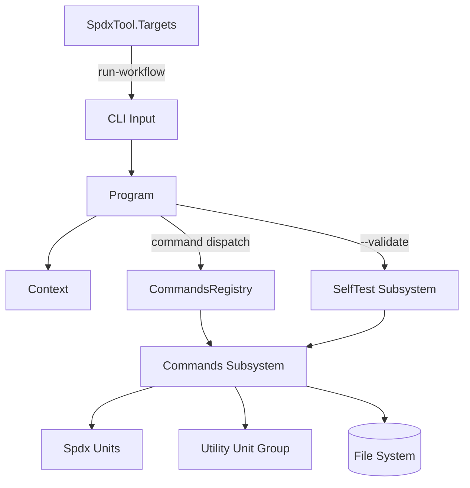

## SpdxTool

### Architecture

DemaConsulting.SpdxTool is a cross-platform .NET tool distributed as a NuGet package that
exposes a command-line interface for creating, validating, and manipulating SPDX documents.
The companion system DemaConsulting.SpdxTool.Targets integrates SPDX decoration into the
dotnet pack workflow via MSBuild targets and is described in the SpdxTool.Targets system design.

The system follows a command-pattern architecture. Program parses global flags and constructs a
Context, then dispatches to CommandsRegistry. Each registered command is a self-contained Command
subclass. The --validate global flag bypasses command dispatch and redirects execution to the
SelfTest subsystem instead.

The Commands subsystem contains one Command subclass per supported CLI subcommand: AddPackage,
AddRelationship, CopyPackage, Diagram, FindPackage, GetVersion, Hash, Help, Print, Query,
RenameId, RunWorkflow, SetVariable, ToMarkdown, UpdatePackage, and Validate. The Spdx units
provide SpdxHelpers and RelationshipDirection. The Utility unit group provides PathHelpers and
Wildcard. The SelfTest subsystem exercises every registered command against embedded SPDX fixtures.

Unit design files for all Commands subsystem units are in the commands subfolder. See also Context
Design and Program Design for the system-level units.

### External Interfaces

**Command-Line Interface**: The tool is invoked as `spdx-tool [options] <command> [arguments]`.
Global options (-h/-?/--help, -v/--version, -s/--silent, -l/--log, --validate, -r/--result, --depth) are parsed by
Program before command dispatch; arguments following the command name are forwarded to the selected
command.

- *Type*: Process entry point.
- *Role*: Provider.
- *Contract*: Each registered command name maps to exactly one Command implementation; unrecognized
  command names are reported as errors and usage information is printed.
- *Constraints*: Global options must precede the command name on the command line.

**File System**: Commands read SPDX JSON documents and YAML workflow files from caller-supplied paths
and write modified SPDX JSON documents back to specified output paths.

- *Type*: External storage.
- *Role*: Consumer and provider.
- *Contract*: Input SPDX files must conform to SPDX 2.x JSON format; YAML workflow files must conform
  to the step schema recognized by the RunWorkflow command.
- *Constraints*: Paths within NuGet-embedded workflows are validated by PathHelpers.SafePathCombine;
  path traversal sequences are rejected with ArgumentException.

**NuGet Cache**: The run-workflow command resolves workflow files embedded in NuGet packages from the
local NuGet cache using the package ID and version declared in the workflow step.

- *Type*: External storage.
- *Role*: Consumer.
- *Contract*: The requested package must be present in the local NuGet cache; a cache miss triggers
  an automatic package restore.
- *Constraints*: Cache miss recovery requires network access and the NuGet feed to be reachable.

**HTTP/Network**: The run-workflow command can load workflow files directly from URLs when the
url field is specified in a workflow step.

- *Type*: External service.
- *Role*: Consumer.
- *Contract*: The URL must return a valid YAML workflow file; when an integrity field is
  provided it must contain the SHA-256 hash of the response body.
- *Constraints*: Network access is required; if the URL is unreachable the step fails with a
  command error.

**MSBuild Integration**: The companion DemaConsulting.SpdxTool.Targets system injects a
DecorateNuGetSbom MSBuild target that invokes spdx-tool run-workflow after dotnet pack. The tool
must be installed as a .NET tool in the build environment for the target to succeed.

- *Type*: Build-system integration.
- *Role*: Provider (tool executable consumed by the Targets system).
- *Contract*: The tool must accept the run-workflow command with the workflow file path supplied by
  the MSBuild target property.
- *Constraints*: The Targets system is a separate deployment unit; see the SpdxTool.Targets system
  design for full details.

### Dependencies

- **DemaConsulting.SpdxModel** - SPDX 2.x document object model, JSON serialization, and
  deserialization via Spdx2JsonSerializer and Spdx2JsonDeserializer.
- **DemaConsulting.NuGet.Caching** - local NuGet cache resolution used by the run-workflow command
  to locate NuGet-embedded workflow files.
- **DemaConsulting.TestResults** - test result writing for the self-validation suite; supports TRX
  and JUnit XML output formats.
- **YamlDotNet** - YAML parsing for workflow files and per-step command argument nodes.

### Risk Control Measures

N/A - not a safety-classified software item.

### Data Flow

1. The user invokes `spdx-tool` at the command line; Program parses global flags and constructs a
   Context carrying the flag state, an optional log writer, and an error counter.
2. If the argument list is empty and --validate was not set, Program records an error
   ('Error: Missing arguments') and prints usage information; execution terminates with exit code 1.
3. If --validate is set, execution is redirected to SelfTest.Validate.Run, which exercises every
   registered command against embedded SPDX fixtures and writes results to the validation file if
   one was specified.
4. Otherwise, Program looks up the command name in CommandsRegistry.Commands and calls
   Command.Run(context, args) on the matched entry; an unrecognized name produces an error and
   prints usage information.
5. The selected command reads any required SPDX JSON documents from the file system via
   SpdxHelpers.LoadJsonDocument, and YAML workflow files via YamlDotNet.
6. The command applies the requested transformation or query using SpdxHelpers, PathHelpers, and
   Wildcard as needed; variable tokens in YAML values are expanded by Command.Expand at execution
   time.
7. Modified SPDX documents are serialized to JSON and written to the output path by
   SpdxHelpers.SaveJsonDocument, which stamps the document with the tool creator entry.
8. Context.ExitCode returns 1 if any errors were recorded during execution; Program exits with
   that code.

### Design Constraints

- **Cross-platform**: The tool targets .NET 8, 9, and 10 and must run on Windows, Linux, and
  macOS; all file path operations use System.IO.Path APIs to maintain portability.
- **No global state**: All mutable runtime state is encapsulated in Context and passed explicitly;
  Command subclasses are stateless.
- **Workflow isolation**: Each workflow step executes within the same Context instance; variables
  maintained by RunWorkflow are passed as a dictionary parameter across step boundaries.
- **Self-contained validation**: The --validate flag runs the full command suite in-process using
  embedded SPDX fixtures; only the ValidateQuery step (spawns dotnet) and the
  ValidateRunNuGetWorkflow step (may restore a NuGet package) require resources outside the
  process.
- **Variable substitution**: `${{ name }}` tokens in YAML values are resolved by Command.Expand
  at step-execution time using the current workflow variable map; undefined variable references
  throw InvalidOperationException.
- **Path safety**: NuGet-embedded workflow paths are validated by PathHelpers.SafePathCombine
  before use; paths containing ".." components or absolute roots are rejected with
  ArgumentException.
